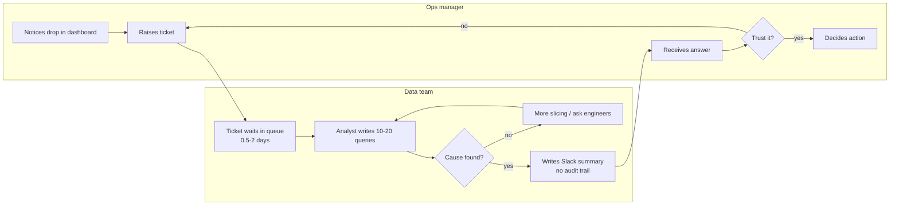
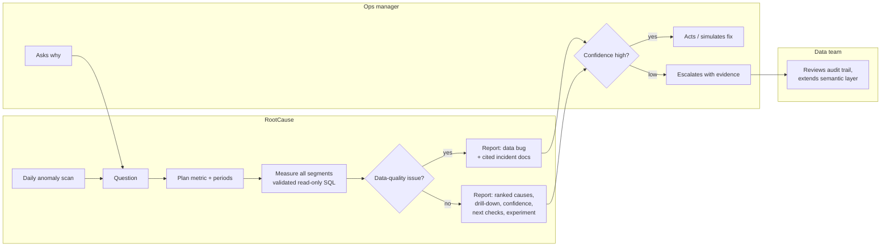

# Process maps (as-is and to-be)

Mermaid diagrams render on GitHub. Swimlanes are shown as subgraphs.

## As-is: investigating a metric drop

**Pain points:** queue time; repetitive slicing; data bugs discovered late; no reusable evidence; the same question asked again next month.

## To-be: with RootCause

**Changes:** the queue is removed for routine cases; every answer carries its queries; data bugs are checked first; analysts handle only low-confidence cases, starting from the evidence rather than from scratch.
